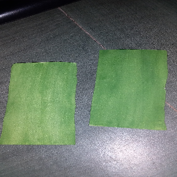

# Air-Guitar
Air Guitar is an amazing script with which you can play guitar in the air. Must Try!

## Requirements

1. Python 3.6 or above

2. OpenCv -->   pip install opencv

3. Pygame --> pip install pygame

4. Webcam

5. Small Green Colored Strips of Paper Like :-

## How To Use

1. Run The main.py File.

2. The Bottom Part Of The Screen Is Divided Into 3 Section. Each Part Plays Different Cord.

3. Move The Strips to The bottom of screen.

4. It Will Play Different Cord Of Guitar In Every Section.

5. Enjoy and Share Your Feedback.
